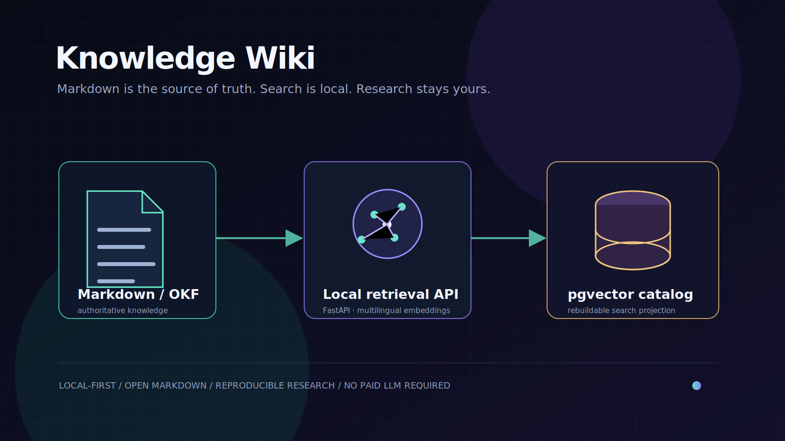

# Knowledge Wiki

[English](README.md) · [한국어](README.ko.md) · [日本語](README.ja.md) · [简体中文](README.zh-CN.md)

<p align="center">
  
</p>

<p align="center">
  <strong>A local-first, Markdown-native knowledge system with reproducible research and local semantic retrieval.</strong>
</p>

<p align="center">
  <a href="#why-this-exists">Why</a> ·
  <a href="#architecture">Architecture</a> ·
  <a href="#quick-start">Quick start</a> ·
  <a href="#knowledge-model">Knowledge model</a> ·
  <a href="#development">Development</a>
</p>

> **Status: early but working.** The authoritative knowledge base is ordinary OKF-flavored Markdown. PostgreSQL and pgvector are derived, replaceable search infrastructure.

## Why this exists

Most personal knowledge tools make the database, a proprietary editor, or an embedding vendor the source of truth. This project makes the durable artifact plain Markdown instead:

- **Own the corpus.** Keep concepts, comparisons, and source captures under local `data/wiki/`; the repository intentionally ships no personal knowledge documents.
- **Keep research auditable.** Captured sources retain their URL, UTC timestamp, and SHA-256 provenance; interpretations link back to evidence.
- **Search locally.** The API runs `intfloat/multilingual-e5-small` locally and stores 384-dimensional vectors in PostgreSQL/pgvector—no paid LLM or embedding API is required.
- **Treat indexes as disposable.** Restarting the API rebuilds the catalog from Markdown; the database is never the only copy of knowledge.
- **Curate rather than merely collect.** The current corpus explores self-hosted feature configuration, remote configuration, OpenFeature, LINE/NAVER-adjacent projects, Spring/JVM, and Python ecosystems.

## Architecture

```text
OKF Markdown ──> FastAPI cataloger ──> PostgreSQL + pgvector ──> React/Vite browser
     │                   │                       │
     │                   └── local multilingual embeddings (384d)
     └── source provenance, internal links, human-readable Git history
```

| Layer | Role | Main technology |
| --- | --- | --- |
| `data/wiki/` | Canonical knowledge bundle | Markdown + YAML frontmatter / OKF v0.1 conventions |
| `server/` | Catalog projection, URL capture, semantic retrieval | FastAPI, Psycopg, Sentence Transformers |
| `infra/postgres/` | Search schema and vector index | PostgreSQL 16 + pgvector |
| `web/` | Browser for documents, graph, and search | React, TypeScript, Vite |
| `docker-compose.yml` | Local development/runtime topology | Docker Compose |

### Retrieval model

The initial retrieval path is deliberately simple and local:

1. Parse Markdown files with non-empty `type` frontmatter.
2. Prefix documents with `passage: ` and embed using `multilingual-e5-small`.
3. Persist a 384-dimensional vector projection in pgvector with cosine HNSW search.
4. Prefix queries with `query: ` and return the most relevant documents.

Markdown remains canonical; deleting the derived database does not lose knowledge.

## Quick start

### Prerequisites

- Docker Desktop / Docker Compose
- Optional for local development: [uv](https://docs.astral.sh/uv/) and Node.js

```bash
git clone https://github.com/hungrytech/knowledge-wiki.git
cd knowledge-wiki

docker compose up -d --build
docker compose ps
curl -fsS http://localhost:8000/api/health
```

Open:

- **Wiki browser:** <http://localhost:5173>
- **API:** <http://localhost:8000/api>
- **PostgreSQL:** `localhost:5433` (local development only)

The first API startup downloads the public multilingual embedding model and persists it in the Docker `knowledge-models` volume. Later starts reuse it.

> This repository deliberately contains no personal corpus. Create your local `data/wiki/` documents after installation; they are ignored by Git so they stay on your machine.

### Verify semantic search

```bash
curl -fsS --get http://localhost:8000/api/semantic-search \
  --data-urlencode 'q=self hosted feature flags remote configuration' \
  --data-urlencode 'limit=5'
```

### Add knowledge manually

Create a Markdown document beneath `data/wiki/` with YAML frontmatter. `Concept`, `Comparison`, `Project`, and `Source` are useful document types.

```markdown
---
type: Concept
title: Example concept
description: A concise explanation of the concept.
tags: [example]
---

# What it is

Write the durable explanation here.
```

Then refresh the derived catalog:

```bash
docker compose restart api
```

## Knowledge model

```text
data/wiki/
├── index.md                   # human navigation
├── log.md                     # curation history
├── concepts/                  # durable explanations
├── comparisons/               # decision-oriented analyses
├── projects/                  # systems and implementations
└── sources/                   # immutable captured primary material
```

### Evidence boundary

A `Source` document preserves external material and provenance. A `Concept` or `Comparison` document adds interpretation. Keeping these separate makes claims reviewable and lets the corpus evolve without silently rewriting source evidence.

## Development

```bash
# Python API tests
uv run --project server pytest server/tests -q

# Web tests and production build
npm --prefix web test -- --run
npm --prefix web run build
```

After editing the knowledge bundle, verify that every projected document has an embedding:

```bash
docker compose exec -T postgres psql -U knowledge -d knowledge_wiki -Atc \
  "SELECT count(*) FILTER (WHERE embedding IS NOT NULL) || '/' || count(*) FROM documents;"
```

## Privacy and security notes

- This project is designed for **local use**. Do not expose the API, database port, or Docker Compose credentials directly to the public internet.
- The Compose PostgreSQL password is a development-only placeholder. Replace it and use managed secret handling before any shared or production deployment.
- URL ingestion should remain restricted to public addresses; preserve sources and inspect fetched content before trusting it.
- Knowledge may contain personal notes or licensed material. Review `data/wiki/` before making a fork or derivative repository public.

## Roadmap

- [ ] Persist heading-aware chunks for more precise retrieval
- [ ] Add PostgreSQL full-text search and reciprocal-rank-fusion hybrid retrieval
- [ ] Improve graph navigation and provenance views
- [ ] Add import/export and corpus-validation tooling
- [ ] Expand primary-source Spring/JVM OSS curation

## License

This project is released under the [MIT License](LICENSE).

---

Built around a simple conviction: **your knowledge should outlive the tool that indexes it.**
